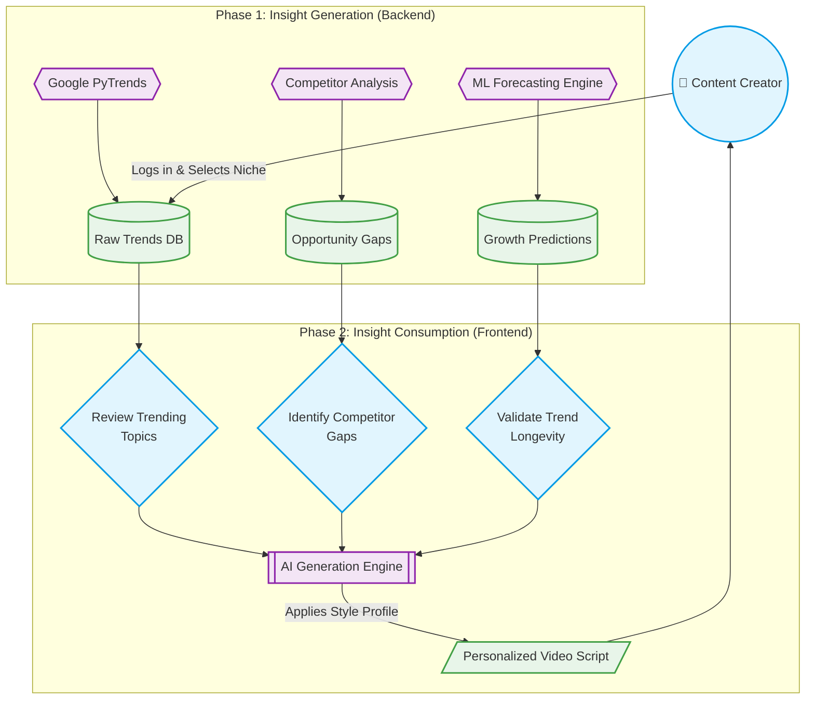

# Trendora — Consumer Flow Diagram

The consumer flow illustrates how a user (the content creator) interacts with the system to "consume" data insights and turn them into actionable content. Utilizing specific shapes to distinguish between External APIs (Hexagons), Data Storage/Insights (Cylinders), User Decisions (Diamonds), and Processes (Subroutines).

## Flow Breakdown

1. **Insight Consumption Phase**: The platform aggregates data from Google Trends, YouTube, and its internal ML models. It serves these as refined insights (Trends, Gaps, Predictions) to the user via the Dashboard.
2. **Action Phase**: The user consumes these insights, deciding which topic has the best combination of low competition (Gap), high search volume (Trend), and future longevity (Prediction).
3. **Execution**: The user passes their chosen insight into the Generation Engine, which applies their personal style profile to produce a script ready for filming.
