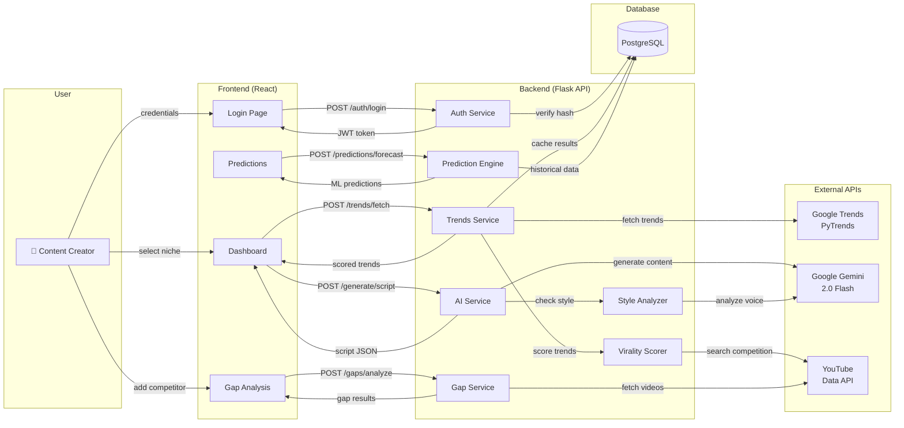
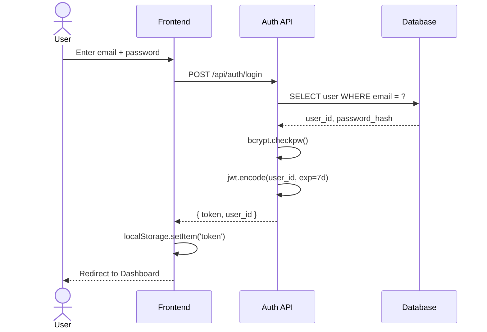
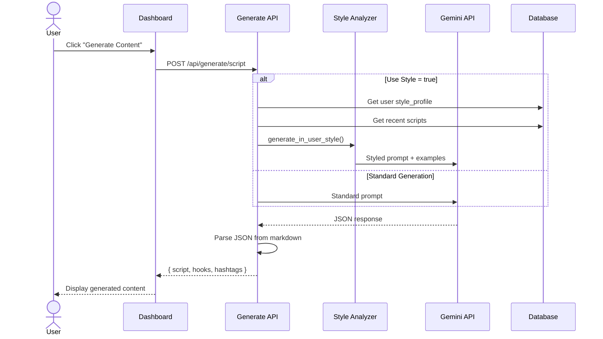
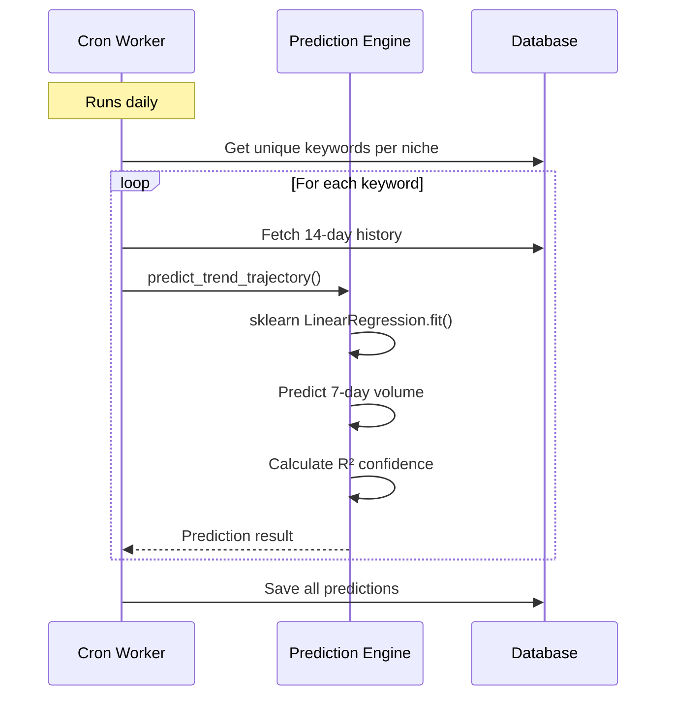

# Trendora — Data Flow Diagram

## Primary Data Flows

```mermaid
flowchart LR
    subgraph "User"
        U[👤 Content Creator]
    end

    subgraph "Frontend (React)"
        FE_LOGIN[Login Page]
        FE_DASH[Dashboard]
        FE_GAP[Gap Analysis]
        FE_PRED[Predictions]
    end

    subgraph "Backend (Flask API)"
        API_AUTH[Auth Service]
        API_TRENDS[Trends Service]
        API_AI[AI Service]
        API_GAP[Gap Service]
        API_VIR[Virality Scorer]
        API_STYLE[Style Analyzer]
        API_PRED[Prediction Engine]
    end

    subgraph "External APIs"
        GOOGLE[Google Trends<br/>PyTrends]
        GEMINI[Google Gemini<br/>2.0 Flash]
        YOUTUBE[YouTube<br/>Data API]
    end

    subgraph "Database"
        DB[(PostgreSQL)]
    end

    U -->|credentials| FE_LOGIN
    FE_LOGIN -->|POST /auth/login| API_AUTH
    API_AUTH -->|verify hash| DB
    API_AUTH -->|JWT token| FE_LOGIN

    U -->|select niche| FE_DASH
    FE_DASH -->|POST /trends/fetch| API_TRENDS
    API_TRENDS -->|fetch trends| GOOGLE
    API_TRENDS -->|score trends| API_VIR
    API_VIR -->|search competition| YOUTUBE
    API_TRENDS -->|cache results| DB
    API_TRENDS -->|scored trends| FE_DASH

    FE_DASH -->|POST /generate/script| API_AI
    API_AI -->|generate content| GEMINI
    API_AI -->|check style| API_STYLE
    API_STYLE -->|analyze voice| GEMINI
    API_AI -->|script JSON| FE_DASH

    U -->|add competitor| FE_GAP
    FE_GAP -->|POST /gaps/analyze| API_GAP
    API_GAP -->|fetch videos| YOUTUBE
    API_GAP -->|gap results| FE_GAP

    FE_PRED -->|POST /predictions/forecast| API_PRED
    API_PRED -->|historical data| DB
    API_PRED -->|ML predictions| FE_PRED
```

## Authentication Flow

```mermaid
sequenceDiagram
    actor User
    participant Frontend
    participant Auth API
    participant Database

    User->>Frontend: Enter email + password
    Frontend->>Auth API: POST /api/auth/login
    Auth API->>Database: SELECT user WHERE email = ?
    Database-->>Auth API: user_id, password_hash
    Auth API->>Auth API: bcrypt.checkpw()
    Auth API->>Auth API: jwt.encode(user_id, exp=7d)
    Auth API-->>Frontend: { token, user_id }
    Frontend->>Frontend: localStorage.setItem('token')
    Frontend-->>User: Redirect to Dashboard
```

## Content Generation Flow

```mermaid
sequenceDiagram
    actor User
    participant Dashboard
    participant Generate API
    participant Style Analyzer
    participant Gemini API
    participant Database

    User->>Dashboard: Click "Generate Content"
    Dashboard->>Generate API: POST /api/generate/script
    
    alt Use Style = true
        Generate API->>Database: Get user style_profile
        Generate API->>Database: Get recent scripts
        Generate API->>Style Analyzer: generate_in_user_style()
        Style Analyzer->>Gemini API: Styled prompt + examples
    else Standard Generation
        Generate API->>Gemini API: Standard prompt
    end
    
    Gemini API-->>Generate API: JSON response
    Generate API->>Generate API: Parse JSON from markdown
    Generate API-->>Dashboard: { script, hooks, hashtags }
    Dashboard-->>User: Display generated content
```

## Prediction Pipeline

```mermaid
sequenceDiagram
    participant Cron Worker
    participant Prediction Engine
    participant Database

    Note over Cron Worker: Runs daily
    Cron Worker->>Database: Get unique keywords per niche
    loop For each keyword
        Cron Worker->>Database: Fetch 14-day history
        Cron Worker->>Prediction Engine: predict_trend_trajectory()
        Prediction Engine->>Prediction Engine: sklearn LinearRegression.fit()
        Prediction Engine->>Prediction Engine: Predict 7-day volume
        Prediction Engine->>Prediction Engine: Calculate R² confidence
        Prediction Engine-->>Cron Worker: Prediction result
    end
    Cron Worker->>Database: Save all predictions
```
