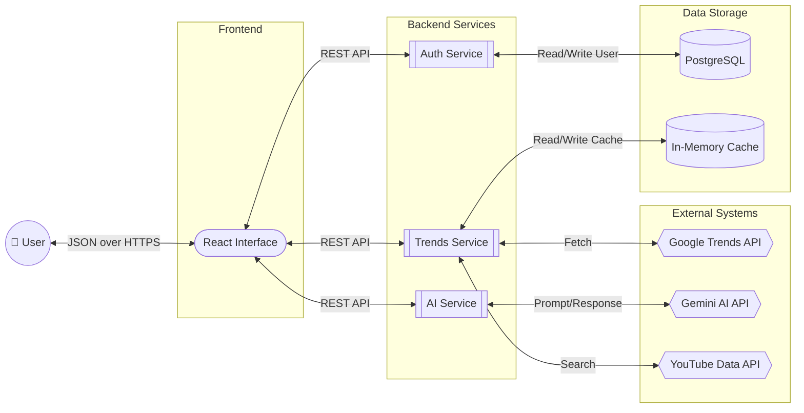
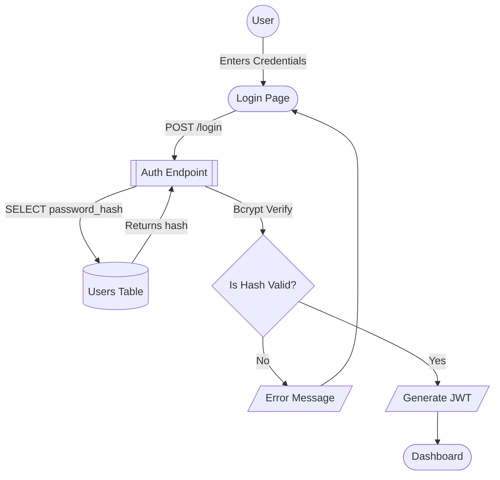
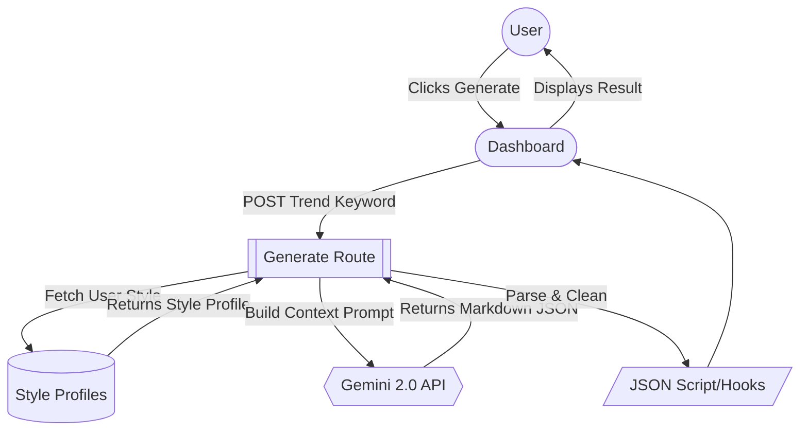
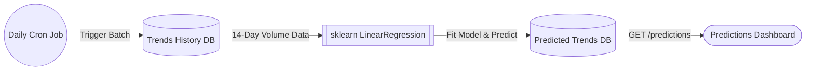

# Trendora — Data Flow Diagram

This diagram maps out how data moves through the system. We use distinct shapes to represent different component types: Circles `()` for Users, Rounded Boxes `([ ])` for UI Interfaces, Double-lined Boxes `[[ ]]` for Internal APIs, Hexagons `{{ }}` for External APIs, Parallelograms `[/ /]` for Documents/Tokens, Diamonds `{}` for Decisions, and Cylinders `[( )]` for Databases.

## 1. Primary Architecture Data Flow

## 2. Authentication Flow

## 3. Content Generation Data Pipeline

## 4. Prediction Engine Flow

